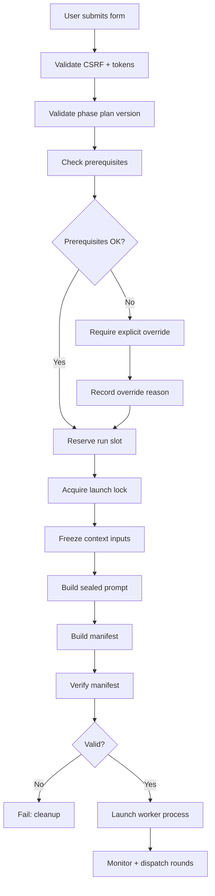

# Launch Pipeline

When a user starts a phase run, Research Hub executes a multi-stage launch pipeline before any agent work begins.

## Pipeline stages

## Stage detail

### 1. Validation
- CSRF token check
- Phase plan version matches the current plan
- Prerequisite report version is current
- Form fields are valid (round count, feedback length, method selection)

### 2. Prerequisite check
- Each `gated_by` prerequisite must be approved and current
- If missing/stale: the UI shows the gap and requires explicit override
- The override reason is recorded in the run metadata

### 3. Run reservation
- A new run slot is reserved atomically in `project.yaml`
- The run ID (UUID) is generated
- If the latest run is `awaiting_review`, a replacement note is required

### 4. Context freezing
- All prerequisite summaries are copied into `<run-id>.context/summaries/`
- Playbooks, souls, and project brief are copied into `<run-id>.context/`
- SHA-256 hashes are computed for every frozen file

### 5. Prompt construction
- The lead prompt is assembled: run envelope + frozen soul + playbooks + context inputs
- The complete prompt is written to `<run-id>.prompt.md`
- Its hash is recorded

### 6. Manifest sealing
- The manifest captures: output_root, summary_path, prompt_sha256, snapshots, method_selection
- The manifest is written and verified against the frozen inputs
- Any mismatch (path, hash) causes immediate failure before the worker starts

### 7. Worker launch
- A Hermes process is started with the sealed prompt
- The process PID is recorded for supervision
- The launch lock is held until the run completes or is cancelled

## Round dispatch

During the run, the system dispatches rounds:

1. **Round start:** write a directive file to `<output_root>/.directives/round-NN.md`
2. **Task dispatch:** for each role, queue a Hermes task with the role-specific brief
3. **Round completion:** when all role tasks complete, advance to the next round
4. **Final:** after all rounds, the lead writes the HTML summary

For sequential phases, stages run one at a time, each owned by a single role.

## Failure and cleanup

If a worker fails or is cancelled:
1. The run enters `stopping`
2. The system verifies the worker and all Hermes tasks have stopped
3. Output artifacts are cleaned up if the run failed before producing valid output
4. The launch lock is released
5. If automatic cleanup fails, the UI offers manual retry or explicit lock release
