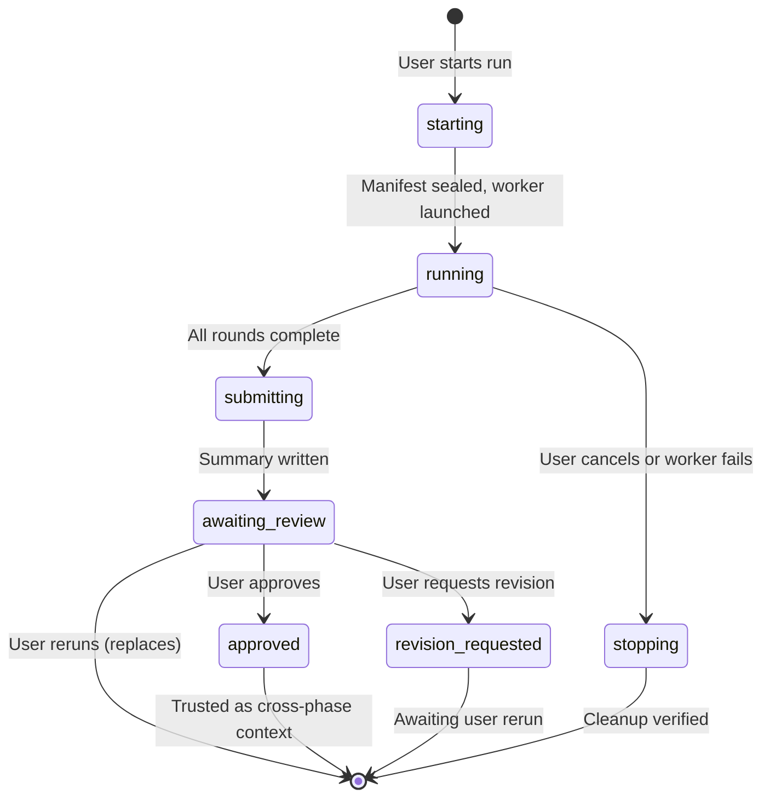

# Control Model

The control model is the heart of Research Hub's safety guarantees: **nothing advances automatically**. The user explicitly starts every run, reviews every result, and makes every decision.

## Run lifecycle

Every phase run follows this lifecycle:

## Key rules

1. **Agents cannot approve their own result.** When agent work finishes, the run enters `awaiting_review`. Only an explicit user decision moves it to `approved`, `revision_requested`, or a rerun.

2. **Only approved, current runs are trusted as cross-phase context.** A run at `awaiting_review` is visible but not trusted. A stale approved run (because an upstream phase was rerun and re-approved) is marked stale and not trusted until the user decides what to do.

3. **One run per project at a time.** Separate projects run independently. The project launch lock prevents concurrent runs within a project.

4. **Reruns never replace approved results.** Starting a new run does not discard a previously approved run. The user can compare the new result against the old approved baseline before deciding.

5. **Approving an upstream replacement marks downstream phases stale.** If you rerun Phase 2 and approve the new result, Phases 3, 4, and 5 are marked stale. Their history is preserved — the user decides whether and when to rerun them.

6. **Every run and summary persists.** A new run never overwrites an earlier summary. The full history is always available for comparison.

7. **Completing or approving a phase never starts the next phase.** The user alone decides when to proceed.

## Prerequisites are warnings, not locks

Each phase declares recommended prerequisites (`gated_by`). If an approved, current prerequisite is missing, the UI explains the gap and requires an **explicit user override** before starting. This lets the user proceed when they judge it safe, while making sure the gap is acknowledged.

## Frozen context

At launch time, Research Hub freezes the exact state of all inputs:

- The approved summary of each prerequisite phase (with SHA-256 hash)
- The phase playbooks and role instructions
- The role souls
- The project brief

These are copied into an immutable `.context/` directory and sealed into the run manifest. The worker reads only from these frozen copies, so the run is reproducible regardless of later changes to playbooks or prior phases.
