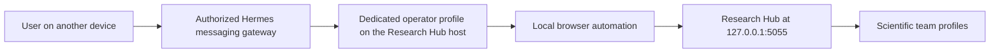

# Direct and Remote Operation

Research Hub has one supported control surface: the local Web UI. You can use it
directly, or an additional Hermes operator profile on the same host can use the
Web UI under your direction.

Remote operation means that the user communicates remotely with the operator
agent. It does not mean that the Research Hub server is exposed remotely.

## The two operating patterns

| Pattern | Control path | Current status |
|---|---|---|
| Direct Web UI | User opens `http://127.0.0.1:5055` and makes each choice | Supported and recommended |
| Hermes operator | User messages a dedicated Hermes profile, which uses a local browser to operate the same Web UI | Advanced and experimental |



The operator is a control assistant. It is not the Research Lead and should not
make scientific choices on the user's behalf.

## Direct Web UI operation

In the direct pattern, the user:

1. opens the project and phase;
2. reviews the current methods, current phase records, and offered context choices;
3. chooses the method or run scope when applicable;
4. provides run-specific direction;
5. launches one run;
6. monitors progress and inspects the resulting evidence;
7. decides whether and how to run another phase or rerun.

No phase starts automatically. A completed run creates material for the user's
next decision.

## Hermes operator pattern

Hermes supports separate profiles, messaging gateways, and browser automation.
These capabilities can be combined into an operator pattern:

1. A dedicated Hermes profile runs on the same host as Research Hub.
2. The user communicates with that profile through an authorized messaging
   channel.
3. The operator uses a local browser backend to open the loopback Web UI.
4. The operator describes the current interface state and asks for confirmation
   before consequential actions.
5. The operator performs the exact action and reports the result.

Research Hub does not currently bundle an operator profile, operator soul,
operator skill, remote API, or end-to-end operator test. The pattern uses
standard Hermes capabilities around the existing Web UI.

## Create a separate operator profile

Do not reuse one of the four scientific profiles.

```bash
hermes profile create hub_operator \
  --description "Operates the local Research Hub Web UI under explicit user direction."
hermes -p hub_operator setup
```

Enable only the tools the operator needs. Browser automation is preferable to
broad terminal access because it preserves the same controls and warnings shown
to a direct user.

Use the current
[Hermes browser documentation](https://hermes-agent.nousresearch.com/docs/user-guide/features/browser)
to configure a local browser backend. A cloud browser cannot directly reach the
host's loopback address. Current Hermes releases can route private and loopback
URLs to a local Chromium sidecar when that local component is installed.

Do not add `hub_operator` to the `agents:` block in Research Hub. It operates
the interface and is not a member of the scientific team.

## Connect the user remotely

Hermes messaging gateways can connect a profile to platforms such as Telegram,
Discord, Slack, and others. Follow the
[Hermes messaging documentation](https://hermes-agent.nousresearch.com/docs/user-guide/messaging)
for the selected platform.

A typical profile command is:

```bash
hermes -p hub_operator gateway start
```

Configure an explicit user allowlist or use Hermes pairing. Do not enable
allow-all access. An authorized gateway user can direct an agent with local tool
access, so that authorization is a system-access boundary, not merely a chat
preference. See the
[Hermes security documentation](https://hermes-agent.nousresearch.com/docs/user-guide/security/)
before starting the gateway.

## Recommended operator contract

Give the operator a narrow standing instruction such as:

```text
Operate only the local Research Hub Web UI at http://127.0.0.1:5055.
Read the current page before acting.

Before any state-changing action:
1. State the project, phase, method, method version, run scope, and warning
   status shown by the interface.
2. Explain exactly what the proposed action will change.
3. Ask the user for explicit confirmation of that exact action.
4. Perform only the confirmed action once.
5. Report the resulting page status and any error.

Never choose a scientific method, retire a method, launch or rerun a phase,
cancel a run, replace a skill, change a profile, edit the project brief, or
release a cleanup lock without explicit user direction.

Never edit Research Hub control files, manifests, state files, or frozen run
records directly.
```

The confirmation should identify the actual choice. "Proceed" is meaningful
only after the operator has named the project, phase, method, version, and scope
that will be used.

## Actions that require explicit confirmation

At minimum, the operator should pause before:

- creating a project or changing its brief;
- changing the workspace;
- assigning a Hermes profile to a role;
- installing or replacing a skill;
- launching or rerunning a phase;
- choosing a Phase 3 or Phase 4 method;
- choosing a Phase 4 preliminary or comprehensive scope;
- retiring a Phase 2 method;
- cancelling an active run;
- releasing a project lock after manual cleanup verification.

Reading pages, checking status, opening logs, and summarizing visible results
can normally remain read-only.

## Security boundaries

Research Hub intentionally:

- binds only to loopback;
- rejects non-loopback server and client addresses;
- has no network user accounts or remote authentication;
- protects state-changing browser requests with session and version checks.

Never change `RESEARCH_HUB_HOST` to a public or LAN address. The application
will refuse a non-loopback bind because it is not designed as a multi-user Web
service.

The operator must run on the Research Hub host, or control a local browser
component on that host. Do not solve remote access by publishing port 5055,
placing it behind an ad hoc proxy, or disabling the loopback checks.

Hermes profiles separate memory, sessions, skills, and configuration. They do
not by themselves create operating-system filesystem isolation. A local
operator profile can have the permissions of the account running Hermes.
Restrict its tools and run it under a trusted, non-administrative account.

## Current operator limitations

The current release has:

- no bundled operator soul or skill;
- no stable machine-facing Research Hub API;
- no operator-specific read and write permissions;
- no action receipt that distinguishes a direct human click from an operator
  click;
- no end-to-end browser and messaging-gateway test for this pattern.

The operator depends on the current HTML interface, so interface changes can
require its browser procedure to be updated.

## Operational discipline

Avoid directing the Web UI simultaneously from a human browser and an operator
agent. Research Hub detects changed project and phase state, but competing
clicks can still create confusion about which view is current.

For consequential research choices, direct Web UI review remains the preferred
path. The operator pattern is useful for:

- checking whether a run has finished;
- reading the current phase status;
- opening and summarizing a run log;
- preparing a proposed action for confirmation;
- carrying out an exact confirmed action when the user is away from the host.

The operator does not bypass Research Hub prerequisites, method-version checks,
single-run project lock, or current interface limitations.
