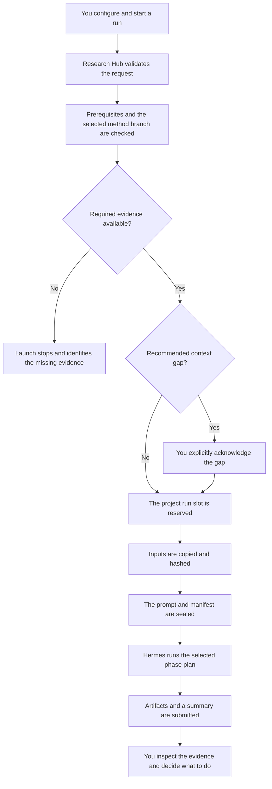

# Architecture and Integrity

Research Hub records exactly what a phase run was asked to use. This provides provenance and change detection. It does not make a language-model execution deterministic, and it does not make agent-generated scientific claims correct.

## What the integrity model protects

At launch, Research Hub freezes the project brief, the assembled prior context,
role instructions, phase playbooks, and other launch inputs. For a method-bound
run, that context can include available prior results and discussion from Phase 3
and Phase 4 on the same branch. Research Hub records hashes for those copies and
for the exact prompt sent to the lead agent.

This lets you answer:

- Which project brief did this run use?
- Which upstream results were treated as context?
- Which method and version was studied?
- Which prompt and role instructions were supplied?
- Did a preserved input or submitted summary change later?

You must still evaluate the scientific content. Hashes establish identity and provenance, not validity.

## What happens when you start a run



Completing one phase never launches another. The next action remains a user decision.

## Frozen inputs

Once launch preparation succeeds, the run receives a run-specific context snapshot. Later edits to the live project do not silently alter the context of a run that is already active.

If upstream or same-branch context changes after launch, the current run still
has its original frozen inputs. The interface can then tell you that the live
project has moved ahead of the run you are inspecting.

Research Hub freezes its own team guidance, standing role instructions, and
phase playbooks. Hermes profile `SOUL.md` and persistent profile memory remain
external Hermes state and are not copied into the run manifest. Essential
scientific facts should therefore be recorded in project artifacts rather than
only in profile memory. See
[Agent Instructions, Memory, and Skills](../team-resources) for the complete
resource model.

## Method branches and sibling phases

Phase 3 and Phase 4 independently select an active method from the Phase 2
catalog. Both freeze the exact method identity, version, and definition and route
their work to the same durable method branch. Either phase can run first. A run
can incorporate available prior summaries, role reports, protocol records, and
supporting evidence from both sibling phases when those records belong to the
same branch. Each Phase 3 and Phase 4 stage writes to an assigned run folder;
Research Hub inventories and hashes that folder before the next stage reuses it.

Phase 5 verifies an intact completed result from each of Phases 1 through 4.
The Phase 3 and Phase 4 results must both match the selected method's stable ID,
version, and definition digest. It cannot satisfy the requirement with a
damaged result, a result from another method, or an incompatible method
version or definition.

## Sealed manifests

Each successfully prepared run has a manifest that identifies:

- the run and phase;
- the selected run plan;
- the method branch, when applicable;
- expected output locations;
- hashes of the prompt and frozen inputs; and
- the submitted summary location.

A simplified example is:

```json
{
  "run_id": "1539c04e-131a-...",
  "run_number": 4,
  "phase_slug": "04-draft-assembly",
  "phase": {
    "slug": "04-draft-assembly",
    "run_plan": "preliminary"
  },
  "method_selection": {
    "stable_id": "spectral-graph-coupling",
    "version": "v1"
  },
  "prompt_sha256": "a1b2c3...",
  "summary_path": "phase-summaries/04-draft-assembly/1539c04e....html"
}
```

Research Hub verifies the manifest and bounded file paths before agent work begins. It verifies submitted artifact identities again when the run finishes.

## Preserved history and current synthesis

Run prompts, frozen inputs, manifests, logs, and submitted summaries are preserved as run-specific records.

Some current synthesis files can change on a later run. Examples include an updated literature synthesis or a revised method definition. The older run records remain intact, so the current synthesis can be traced back to the runs that produced it.

See [Files and Research Records](./files-and-records) for the user-facing file map.

## Project lock

Only one run can be active in a project at a time. This protects project state and prevents two phases from writing overlapping records concurrently.

If a worker is cancelled or fails, Research Hub completes cleanup before releasing the lock. When automatic cleanup cannot be confirmed, the interface provides a recovery path that requires explicit manual verification.

## Completed records and user choices

A completed run preserves material for inspection and later use. Completion
does not start another run or make a scientific conclusion on the user's
behalf.

The user can inspect the summary and artifacts, rerun the same phase with new
direction, start another eligible phase, or stop. Phase 2 publishes a valid
method catalog and allows methods to be retired explicitly. Phases 3 and 4
select methods at launch. Phase 5 verifies the required completed records and
exact method identity before it can run.

See [Review Results and Choose What Happens Next](../workflow/decisions).

## Security boundary

Research Hub is a local research tool, not a multi-user Web service.

The local Web UI does not imply local model execution. Research Hub passes the
phase prompt and assembled run context through Hermes to the model provider
configured for each profile. Agent tools may also contact external services.

- It binds to `127.0.0.1` by default.
- It has no user accounts or network authentication.
- State-changing requests use CSRF protection.
- Agent-generated HTML is served under a restrictive browser policy.
- Agent output is untrusted scientific material and must be reviewed critically.

Review the provider and tool data-handling policies before using confidential,
clinical, genomic, or otherwise sensitive data. Do not put credentials or
secrets in project briefs, instructions, logs, feedback, or summaries.

For assisted control from another device, Research Hub must remain loopback-only.
The remote connection terminates at a separate Hermes operator profile on the
same host. See [Direct and Remote Operation](../operation-modes).

## Maintainer map

The main implementation areas are:

| Location | Responsibility |
|---|---|
| `webapp.py` and `templates/` | Web routes and user interface |
| `hub.py` | Configuration, registry, and project discovery |
| `core/launch_*.py` | Run planning, frozen context, prompts, manifests, dispatch, and supervision |
| `core/project_state.py` | Project state, run transitions, prerequisites, and staleness |
| `config/phases/` | Phase and role instructions |
| `config/souls/` | Durable role identities |
| `bundled_skills/` | Pinned recommended Hermes skills |
