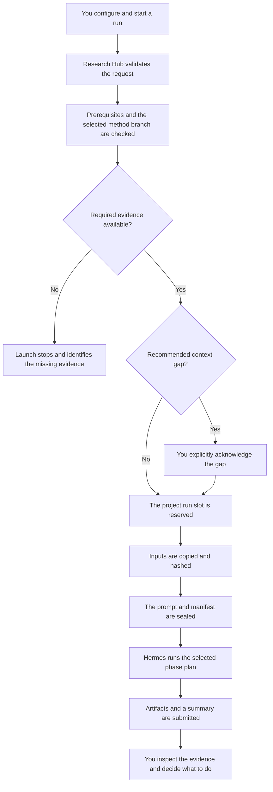

# Architecture and Integrity

Research Hub records exactly what a phase run was asked to use. This provides provenance and change detection. It does not make a language-model execution deterministic, and it does not make agent-generated scientific claims correct.

## What the integrity model protects

At launch, Research Hub freezes the project brief, verified current records,
role instructions, phase playbooks, and other launch inputs. For Phase 3, this
also includes archived Phase 3 summaries only when the user selected them. For a
method-bound run, every record must belong to the same branch and method
identity. Research Hub records hashes for those copies and for the exact prompt
sent to the lead agent.

This lets you answer:

- Which project brief did this run use?
- Which upstream results were treated as context?
- Which method and version was studied?
- Which prompt and role instructions were supplied?
- Did a preserved input or submitted summary change later?

You must still evaluate the scientific content. Hashes establish identity and provenance, not validity.

## What happens when you start a run



Completing one phase never launches another. The next action remains a user decision.

## Frozen inputs

Once launch preparation succeeds, the run receives a run-specific context snapshot. Later edits to the live project do not silently alter the context of a run that is already active.

If upstream or same-branch context changes after launch, the current run still
has its original frozen inputs. Every run uses this frozen launch context, so a
later edit cannot silently change the evidence supplied to an active run.

For Phase 2, the frozen snapshot identifies the exact current Phase 1 reference
collection and literature synthesis. Research Hub later attaches that basis to
each method covered by a valid publication. A Phase 1 update made after launch
cannot be attributed to the active Phase 2 run.

Research Hub freezes its own team guidance, standing role instructions, and
phase playbooks. Hermes profile `SOUL.md` and persistent profile memory remain
external Hermes state and are not copied into the run manifest. Essential
scientific facts should therefore be recorded in project artifacts rather than
only in profile memory. See
[Agent Instructions, Memory, and Skills](../team-resources) for the complete
resource model.

## Phase 2 definition and review provenance

Research Hub stores provenance separately for each method in the current Phase 2
catalog. It distinguishes two questions:

1. **Where did this definition come from?** The definition source is the Phase 2
   run that last changed the exact current method definition.
2. **When was this method last reviewed against the literature?** The review
   source is the most recent Phase 2 run that assessed the method against its
   recorded Phase 1 reference collection and synthesis.

A valid Complete or Partial full-catalog run advances the review source and
literature basis for every catalog entry. A focused run advances them only for
the selected method. If a covered method is retained without a definition
change, its definition source remains unchanged.

These fields are system-managed. Research Hub calculates the method identity and
writes the provenance after validating the staged catalog. Agents provide the
scientific assessment but do not author the provenance block.

This separation allows a literature update to be reviewed without falsely
recording a new method definition.

Each method file has exactly one authoritative `## Mathematical definition`
section. Research Hub computes `definition_sha256` from that section. Any
change that can alter a calculation requires a new method version. Status,
literature positioning, explanatory prose, and formatting outside that section
may change without a new version when the mathematical calculation is
unchanged. Retaining a version requires leaving the authoritative section
exactly unchanged. Publication rejects a changed definition under an unchanged
version.

## Method branches and sibling phases

Phase 3 and Phase 4 independently select an active method from the Phase 2
catalog. Both freeze the exact `stable_id`, version, and `definition_sha256` and
route their work to the same durable method branch. Either phase can run first. Phase
3 uses the current theory manuscript and current empirical package, plus optional
archived Phase 3 summaries. Phase 4 uses the current theory manuscript and the
cumulative empirical synthesis and evidence index. Each stage writes to an
assigned run folder; Research Hub inventories and hashes that folder before the
next current-run stage reuses it.

Phase 5 verifies a usable current result from each of Phases 1 through 4. For the
selected method, its recorded Phase 2 literature basis must match the current
Phase 1 reference collection and synthesis. Research Hub uses that method's
review-source run as the Phase 2 prerequisite, which may differ from the newest
Phase 2 run after a focused update. Phase 1, that Phase 2 review, and Phase 4 may
be Complete or Partial; Phase 3 must be Complete, and Failed never qualifies.
The Phase 3 and Phase 4 results must match the selected method and the current
sibling semantic basis recorded by each phase. Phase 4 must also have no
outdated or unresolved evidence.

## Branch alignment status

Research Hub rebuilds the branch graph from authoritative current records. Its
protected cache is a derived status view, not a scientific record or a claim
that the method is correct.

The graph separates three forms of alignment:

- Phase 1 reference-collection and synthesis edges record the literature basis
  reviewed for each Phase 2 method.
- Phase 2 method-definition edges connect the current method to its Phase 3 and
  Phase 4 records.
- Phase 5 has separate edges to its Phase 1 collection, Phase 1 synthesis,
  method, theory, and empirical inputs.

Each Phase 3 run also records the exact Phase 4 semantic basis available at
launch, and each Phase 4 run records the exact Phase 3 basis. An absent sibling
is recorded as absent.

A new Phase 1 result makes a method's Phase 2 literature status yellow when its
recorded basis no longer matches. This signal does not change the method
definition, so it does not by itself make Phase 3 or Phase 4 yellow. A
full-catalog Phase 2 review can clear the signal for every method; a focused
review clears it only for the selected method. If Phase 2 changes the method
definition and advances its version, its Phase 3 and Phase 4 method-definition
edges become yellow.

Phase 5 cannot launch for a method while its Phase 2 literature status is yellow
or cannot be verified. A change to either direct Phase 1 manuscript edge also
makes an existing manuscript yellow. A legacy method or manuscript without an
explicit basis is yellow rather than invalid.

The branch view projects these records into separate fields:

| Field | Question answered |
|---|---|
| **Method applicability** | Does the record match the exact current `stable_id`, version, and definition digest? |
| **Sibling basis** | Does the record use the current semantic basis from the sibling Phase 3 or Phase 4 package? |
| **Research attention** | Are any Phase 4 evidence entries outdated or unresolved? |
| **Scientific outcome** | Did the authorized run finish as Complete, Partial, or Failed? |

Alignment fields use the following states:

| Interface state | Meaning |
|---|---|
| **Green: Current** | The displayed method or recorded basis matches its authoritative current record. |
| **Yellow: Review needed** | An input changed or a legacy record has no explicit basis. Inspect the stated reason and decide whether to rerun. |
| **Red: Invalid** | A record or required basis cannot be verified. |
| **Not run** | No current record exists for this phase and method. |

Research attention is reported independently from method and sibling alignment.
For Phase 4, exact-method scientific outputs and code become outdated after a
calculation-defining version change. Raw data and generic infrastructure remain
reusable only when the record establishes mathematical independence. A
recomputation or revalidation creates a new evidence ID and never reactivates
an old non-current ID.

Scientific outcome is also independent. Complete means that the authorized
work was completed to its phase standard; it does not certify mathematical
correctness, empirical strength, alignment, or absence of research attention.
No status starts a phase. Research Hub never infers an unrecorded earlier basis.
You may inspect a changed record and defer unless you want to start a phase whose
prerequisites require current alignment.

## Sealed manifests

Each successfully prepared run has a manifest that identifies:

- the run and phase;
- the selected run plan;
- the method branch, when applicable;
- expected output locations;
- hashes of the prompt and frozen inputs; and
- the submitted summary location.

A simplified example is:

```json
{
  "run_id": "1539c04e-131a-...",
  "run_number": 4,
  "phase_slug": "04-draft-assembly",
  "phase": {
    "slug": "04-draft-assembly",
    "run_plan": "preliminary"
  },
  "method_selection": {
    "stable_id": "spectral-graph-coupling",
    "version": "v1"
  },
  "prompt_sha256": "a1b2c3...",
  "summary_path": "phase-summaries/04-draft-assembly/1539c04e....html"
}
```

Research Hub verifies the manifest and bounded file paths before agent work begins. It verifies submitted artifact identities again when the run finishes.

## Sealed run provenance and current records

Run prompts, frozen inputs, manifests, logs, and submitted summaries are
preserved as run-specific provenance records.

Current scientific records follow phase-specific rules. Phase 1 adds unique
references. Phase 2 updates one catalog and records separate definition and
literature-review provenance for each covered method. Phase 3 replaces one
complete theory manuscript. Phase 4 accumulates indexed evidence and rewrites
its synthesis. Phase 5 replaces one current manuscript.

Sealed run records remain intact, but they are not all loaded into each later
run. Per-method Phase 2 provenance points to the relevant sealed source runs
without loading every Phase 2 history entry.

See [Files and Research Records](./files-and-records) for the user-facing file map.

## Project lock

Only one run can be active in a project at a time. This protects project state and prevents two phases from writing overlapping records concurrently.

If a worker is cancelled or fails, Research Hub completes cleanup before releasing the lock. When automatic cleanup cannot be confirmed, the interface provides a recovery path that requires explicit manual verification.

## Completed records and user choices

A completed run preserves material for inspection and later use. Completion
does not start another run or make a scientific conclusion on the user's
behalf.

The user can inspect the summary and artifacts, rerun the same phase with new
direction, start another eligible phase, or stop. Phase 2 publishes a valid
method catalog and allows methods to be retired explicitly. Phases 3 and 4
select methods at launch. Phase 5 verifies the required current records,
scientific outcomes, and exact method identity before it can run.

See [Review Results and Choose What Happens Next](../workflow/decisions).

## Security boundary

Research Hub is a local research tool, not a multi-user Web service.

The local Web UI does not imply local model execution. Research Hub passes the
phase prompt and assembled run context through Hermes to the model provider
configured for each profile. Agent tools may also contact external services.

- It binds to `127.0.0.1` by default.
- It has no user accounts or network authentication.
- State-changing requests use CSRF protection.
- Agent-generated HTML is served under a restrictive browser policy.
- Agent output is untrusted scientific material and must be reviewed critically.

Review the provider and tool data-handling policies before using confidential,
clinical, genomic, or otherwise sensitive data. Do not put credentials or
secrets in project briefs, instructions, logs, feedback, or summaries.

For assisted control from another device, Research Hub must remain loopback-only.
The remote connection terminates at a separate Hermes operator profile on the
same host. See [Direct and Remote Operation](../operation-modes).

## Maintainer map

The main implementation areas are:

| Location | Responsibility |
|---|---|
| `webapp.py` and `templates/` | Web routes and user interface |
| `hub.py` | Configuration, registry, and project discovery |
| `core/launch_*.py` | Run planning, frozen context, prompts, manifests, dispatch, and supervision |
| `core/project_state.py` | Project state, run transitions, prerequisites, and staleness |
| `config/phases/` | Phase and role instructions |
| `config/souls/` | Durable role identities |
| `bundled_skills/` | Pinned recommended Hermes skills |
