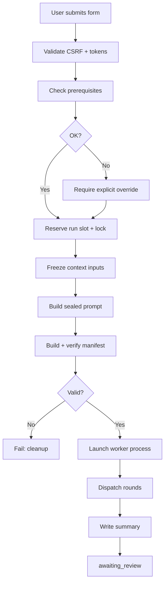

# Architecture & Integrity

This page covers how Research Hub works under the hood: the launch pipeline, sealed manifests, and integrity guarantees. Useful for developers and anyone wanting to understand the reproducibility model.

## Repository layout

```text
research-hub/
├── webapp.py                     ← Flask entry point
├── hub.py                        ← Project registry, config loader
├── config.yaml                   ← Main configuration
├── core/                         ← Application package
│   ├── launch_run.py                orchestration facade
│   ├── launch_manifest.py           manifest structure + validation
│   ├── launch_plans.py              plan selection, method binding
│   ├── launch_prompts.py            sealed prompts, task briefs
│   ├── launch_dispatch.py           round tracking, task dispatch
│   ├── launch_supervision.py        reconciliation, cleanup
│   ├── project_state.py             state machine: runs, approvals
│   └── web_phase_data.py            read-only view models for the UI
├── config/                       ← Phase playbooks and team definition
│   ├── phases/                      one directory per phase
│   │   └── <slug>/
│   │       ├── _phase.md               phase purpose, outputs, criteria
│   │       ├── _lead.md                lead coordination protocol
│   │       └── <role>.md               per-role instructions
│   ├── souls/                       agent personality files
│   └── team/                        charter and norms
├── bundled_skills/               ← Pinned Hermes skills
├── static/                       ← Browser assets
└── templates/                    ← Jinja2 HTML templates
```

## Runtime data layout

```text
~/research/
├── hub.db                           ← project registry (SQLite)
└── projects/
    ├── .research-hub-control/       ← internal control directory
    │   └── <project-slug>/
    │       ├── project.yaml             run state (atomic, locked)
    │       ├── project.lock
    │       └── runs/<phase-slug>/       sealed run artifacts
    │           ├── <run-id>.prompt.md
    │           ├── <run-id>.manifest.json
    │           ├── <run-id>.context/
    │           └── <run-id>.log
    └── <project-slug>/              ← agent-writable workspace
        ├── setting.md                    research brief
        ├── phase-summaries/<slug>/       HTML run summaries
        ├── branches/<method>/            method-bound run output
        ├── references/                   Phase 1 output
        └── ideas/                        Phase 2 output
```

The **control directory** is managed by the system — agents don't write here. The **workspace directory** is agent-writable — this is where research artifacts live.

## The launch pipeline

When you start a phase run, Research Hub executes a multi-stage pipeline before any agent work begins:



### Stage detail

1. **Validation**: CSRF check, phase plan version, prerequisite report version, form fields
2. **Prerequisite check**: each `gated_by` prerequisite must be approved and current (or explicitly overridden)
3. **Run reservation**: a new run slot is reserved atomically in `project.yaml`; the run ID (UUID) is generated
4. **Context freezing**: all prerequisite summaries, playbooks, souls, and the project brief are copied into an immutable `.context/` directory with SHA-256 hashes
5. **Prompt construction**: the lead prompt is assembled (run envelope + soul + playbooks + context), written to `.prompt.md`, and hashed
6. **Manifest sealing**: the manifest captures output paths, prompt hash, frozen input hashes, and method selection. Any mismatch causes immediate failure.
7. **Worker launch**: a Hermes process is started with the sealed prompt

## Sealed manifests

Every run has a sealed manifest at `.research-hub-control/<project>/runs/<phase>/<run_id>.manifest.json`.

### What it records

```json
{
  "run_id": "1539c04e-131a-...",
  "run_number": 4,
  "output_root": ".../branches/spectral-graph-coupling/evaluations/run/04",
  "summary_path": ".../phase-summaries/03-idea-evaluation/1539c04e....html",
  "prompt_sha256": "a1b2c3...",
  "snapshots": {
    "playbooks": {"sha256": "d4e5f6..."},
    "summaries": {"sha256": "789abc..."}
  },
  "method_selection": {
    "stable_id": "spectral-graph-coupling",
    "version": "v1"
  }
}
```

### Verification points

- **At launch**: frozen inputs are hashed and compared against the manifest
- **During the run**: the worker reads only from frozen `.context/` copies
- **At submission**: output artifacts are validated against expected paths
- **At approval**: the summary hash is recorded in a decision record

If any frozen input changes after launch, verification fails. This makes every run's exact inputs auditable and reproducible.

The `run_number` field is sealed in the manifest and stored in the run record at creation time. It survives phase slug merges — when two phases are consolidated (e.g. legacy `05-data-analysis` + `06-paper-writing` → `05-review-revision`), each run retains its original number rather than drifting to a positional index in the merged list.

## Integrity guarantees

1. **Frozen context** — at launch, all inputs are copied and hashed. The worker reads only frozen copies.
2. **Sealed prompts** — the exact prompt text is hashed and recorded.
3. **Hash-verified summaries** — downstream phases verify they consumed the exact same summary content.
4. **Decision records** — every approval creates an immutable record of what was approved, when, and with what context.
5. **Provenance chain** — you can trace any claim back to the exact run that produced it, and verify that run's inputs haven't changed.

## The launch lock

Only one run can be active per project at a time. The project lock (`project.lock`) prevents concurrent runs. The lock is held from launch through cleanup — if a worker fails or is cancelled, cleanup must complete before the next run starts.

If automatic cleanup cannot be confirmed, the web UI lets you retry it or explicitly release the lock after manually verifying shutdown.

## Security boundary

Research Hub is a **local research tool**, not a multi-user service:
- Binds to `127.0.0.1` by default; refuses non-loopback hosts
- No user accounts or network authentication
- CSRF protection on state-changing requests
- Agent summaries served with restrictive CSP and browser sandbox
- Agent output is **untrusted research material** — read critically before approval

Do not put API keys or secrets in project briefs, playbooks, feedback, logs, or summaries. Hermes credentials stay in Hermes configuration or environment.
