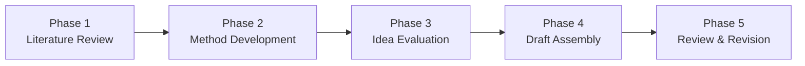

# Research Workflow Overview

Research Hub organizes a research project into **five sequential phases**. Each phase produces evidence that, once approved, becomes trusted context for the next phase.

## The pipeline

## Phase summary

| Phase | Pattern | Participants | Rounds | Key output |
|-------|---------|-------------|--------|------------|
| 1. Literature Review | Parallel | theorist, research_lead, data_scientist | 1–5 | references/ — structured literature notes |
| 2. Method Development | Parallel | theorist, research_lead, data_scientist | 2–3 | ideas/methods/ — proposed methods with math definitions |
| 3. Idea Evaluation | Debate | theorist, research_lead, data_scientist | 2–3 | evaluations/ — proved theorems and rate bounds |
| 4. Draft Assembly | Parallel | theorist, research_lead, data_scientist | 2 | draft/sections/ — the paper draft |
| 5. Review & Revision | Sequential | paper_reviewer → research_lead | 2 stages | draft/revised/ — final manuscript |

## How phases connect

Each phase's **approved summary** (an HTML decision brief) becomes frozen, hash-verified context for downstream phases. When Phase 3 runs, it receives the approved summaries of Phases 1 and 2 as trusted inputs — not the raw round files.

This means:
- A downstream phase always knows exactly which version of upstream results it consumed
- Rerunning an upstream phase and approving the new result marks downstream phases as **stale** — the user decides whether to rerun them
- The provenance chain is fully auditable

## Round patterns

### Parallel rounds (Phases 1, 2, 4)
- **Round 1**: each role works independently
- **Round 2+**: cross-pollination — roles read each other's prior-round outputs, refine, and propose new ideas sparked by other perspectives

### Debate rounds (Phase 3)
- **Round 1**: each role works independently (theorist proves, data analyst assesses cost, lead positions)
- **Round 2+**: challenge and revise — roles critique each other's claims, concede or hold with reasoning, and converge toward consensus

### Sequential stages (Phase 5)
- Stages run **one at a time**, each owned by a single role
- Stage 1 (paper reviewer): audit the draft
- Stage 2 (research lead): revise based on the review

## What the user does at each phase

1. **Start the run** — choose round count, add optional direction
2. **Monitor** — watch progress, read the live log
3. **Review** — read the HTML summary at `awaiting_review`
4. **Decide** — approve, request revision, or rerun
5. **Proceed** — start the next phase when ready

The user is never bypassed. Agents produce evidence; the user makes every decision.
