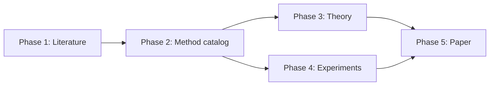

# Research workflow

Research Hub separates a research project into five phases so that you can
evaluate the evidence before deciding what happens next. A completed run makes
its summary and supporting material available for inspection. You decide
whether to use that material as context, rerun with new direction, start an
eligible phase, or stop.

## The five scientific questions

| Phase | Question you are deciding | Evidence you receive |
|---|---|---|
| [1. Literature Review](./phase-1) | Is the relevant literature understood well enough to define the contribution and proceed? | Search scope, closest prior work, foundations, implementations, unresolved overlap, and coverage gaps |
| [2. Method Development](./phase-2) | Is there a scientifically valuable and sufficiently precise method worth evaluating? | A ranked method menu, mathematical definitions, assumptions, novelty arguments, computational implications, and a team recommendation |
| [3. Theoretical Development](./phase-3) | Which claims are supported, which remain conjectural, and which fail under stated assumptions? | Proofs or proof plans, assumption checks, counterexamples, failure regimes, and a claim-by-claim assessment |
| [4. Implementation and Experiments](./phase-4) | Does the method work computationally and empirically under an adequate evaluation design? | Implementation evidence, diagnostics, benchmark comparisons, uncertainty, robustness checks, and limitations |
| [5. Paper Assembly and Review](./phase-5) | Is the manuscript accurate, coherent, reproducible, and ready for its intended audience? | An assembled manuscript, context-separated internal review, revised claims, and a readiness assessment |

Phase 3 and Phase 4 are sibling studies. After Phase 2, you may start either
one for any active method, then return to the other when useful. Phase 5 becomes
available only after Phases 1 through 4 have intact completed results and the
sibling results match the same selected method snapshot. Finishing one phase
never starts another.

## Your decision cycle

Use the same scientific cycle for every phase:

1. **Frame the run.** State the question you want the team to resolve.
2. **Launch deliberately.** Choose the phase, method when applicable, available
   run settings, and any specific direction.
3. **Follow the work.** Monitor progress and inspect the reports produced during
   the run.
4. **Review the evidence.** Read the final summary, disagreements, missing work,
   and supporting artifacts needed to assess consequential claims.
5. **Choose the next action.** Use relevant material as context, rerun with
   specific direction, start another eligible phase, or stop.
6. **Launch explicitly.** No later phase or rerun starts until you choose it.

See [Review results and choose what happens next](./decisions) for a practical
review and rerun guide.

## While a run is active

Only one run can be active in a project. Open the active phase to see its
technical status and select **Open live log** when you need the detailed
execution record. A running status reports process progress, not scientific
validity.

Select **Cancel run** when you decide the work should stop. Research Hub
preserves completed work in that run's record.

If the interface reports that cleanup is pending, the project remains locked
until Research Hub can confirm that the local worker and Hermes tasks have
stopped. Select **Retry cleanup** first. Use **Release after manual
verification** only after you have independently confirmed that no worker or
Hermes task for the run remains active. Releasing the lock does not stop those
processes.

After a run stops, inspect the preserved record before deciding whether to
rerun the phase with new direction.

## What you decide before launch

Before each run, decide:

- **The scientific question.** What uncertainty should this run reduce?
- **The scope.** Is this an initial assessment, a focused correction, or an
  extension of earlier work?
- **The available run settings.** Choose a round count only when the phase offers
  it. In Phase 4, choose preliminary or comprehensive according to the empirical
  scope you need; neither scope requires the other.
- **Your direction to the team.** State the population, estimand, assumptions,
  method family, benchmark, biological setting, or claim that deserves special
  attention.
- **Whether the available inputs are adequate.** If earlier material is
  incomplete or no longer aligned with the question, decide whether to rerun
  the relevant phase, narrow the new instructions, or proceed when the launch
  conditions permit. The current form assembles eligible context automatically.

Good direction is specific enough to guide inquiry without deciding the answer
in advance. For example:

- "Compare the proposed estimator with methods that target the same estimand
  under dependent sampling."
- "Check whether the claimed rate requires strong convexity or only a spectral
  gap."
- "Evaluate performance across sample size, signal strength, and distribution
  shift, with uncertainty from independent repetitions."

## What the team does

The roles contribute different forms of scientific scrutiny:

- In Phases 1 and 2, the research lead, theorist, and data analyst begin with
  distinct analyses. Later rounds compare their conclusions and investigate
  specific conflicts or gaps.
- In Phase 3, the theorist performs the main mathematical analysis, the data
  analyst stress-tests its computational implications and assumptions, and the
  research lead synthesizes both reports.
- In Phase 4, the data analyst performs the main implementation and empirical
  analysis, the theorist audits correspondence with the method and theory, and
  the research lead synthesizes both reports.
- In both Phase 3 and Phase 4, later stages read the earlier stages, and every
  role receives available prior results and discussion from both phases on the
  same method branch.
- In Phase 5, work depends on the selected mode. The research lead performs
  Assembly, a Review target uses the Paper Reviewer, and Review & Revision uses
  the Paper Reviewer followed by the research lead.

The research lead synthesizes the reports, but does not make the user's
decision. A recommendation should state its evidence, uncertainty, and credible
alternatives.

## What every summary should let you judge

A useful phase summary should make the following visible:

- the question and scope actually examined;
- the status of each material scientific statement;
- the strongest supporting and contradicting evidence;
- assumptions, uncertainty, and conditions of validity;
- disagreements among roles and whether they were resolved;
- missing work and its consequence for later phases;
- material changes from earlier results;
- a clear recommendation with reasons;
- the earlier result used for comparison, when one exists.

A completed summary is material for scientific judgment. Completion does not
certify its claims or trigger another action. Inspect it before deciding how, or
whether, later work should use it.

## What you can do after a run

| Your action | When it is useful | Effect |
|---|---|---|
| **Let the result inform later work** | The material is relevant and sufficiently reliable for the next question. | Eligible material is assembled automatically. Inspect it before launch; the context received by the run is frozen. |
| **Rerun the phase** | A new pass could resolve a gap, test a changed assumption, or use new evidence. | A new run is created. Earlier runs remain available for comparison. |
| **Start another eligible phase** | Its required conditions are satisfied and the available evidence is sufficient for its purpose. | Only the phase you explicitly start will run. |
| **Stop or defer** | The direction is not useful or no further work is currently warranted. | Nothing else starts. The completed material remains available. |

## Dependencies and newer evidence

Phase 1 has no prerequisite. Phase 2 can use available Phase 1 literature
evidence and publishes the method catalog without selecting one method.

Phase 3 and Phase 4 both show that catalog as a read-only list. When launching
either phase, you explicitly choose an active method. The method identity,
version, and definition are frozen for that run, and work for the same method is
routed to one durable branch. Either sibling phase can run first. Each run can
use available prior results and discussion from both phases on the same branch.

Phase 5 requires an intact completed result from each of Phases 1 through 4.
The Phase 3 and Phase 4 results must both match the selected method's stable ID,
version, and definition digest. It does not combine theory and experiments from
different methods or silently substitute an older method version or
definition.

When a newer upstream result changes an assumption, method definition, dataset,
implementation, or conclusion used downstream, the earlier downstream result
remains preserved with its original context. Inspect the affected claims and
decide whether the change is immaterial or whether a focused or full rerun is
needed.

Some missing recommended prerequisites can be acknowledged through an explicit
override when the launch form offers one. Phase 3 and Phase 4 still require a
valid active method. The Phase 5 integrity and exact method-snapshot
requirements are not overridable.

## Rerun with a purpose

The intended workflow lets you return to any phase when the scientific question
warrants another pass. After Phase 2, Phase 3 and Phase 4 can be launched or
rerun independently. Phase 5 remains subject to the full Phase 1 through Phase 4
integrity and method-snapshot requirements above. A useful rerun should state
what has changed and what evidence would alter your decision.

On a rerun, the team should:

1. compare the new question with the available earlier results and discussion;
2. identify correct, uncertain, incomplete, or contradicted material;
3. preserve valid earlier evidence;
4. investigate the named gap or changed assumption;
5. report what changed and why.

The new result does not erase the earlier run. Both remain in the research
record so you can compare what changed and decide which material to use.

For the location and interpretation of run summaries, scientific artifacts,
and decision records, see
[Files and research records](../reference/files-and-records).
