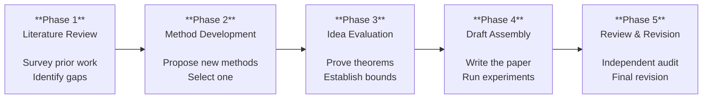
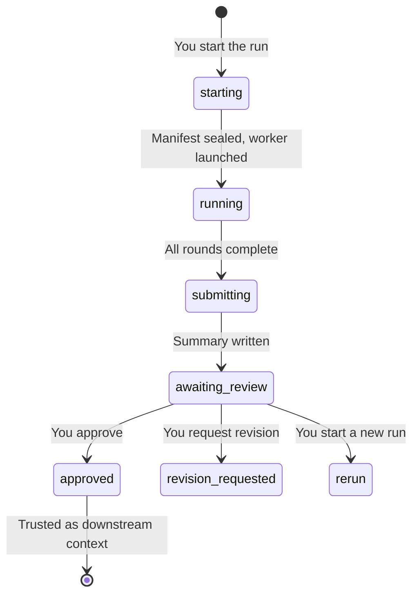

# Pipeline Overview

Research Hub organizes a research project into **five sequential phases**. Each phase produces evidence that, once you approve it, becomes trusted context for the next phase. You control every transition.

## The pipeline

## Phase summary

| Phase | Pattern | Participants | Rounds | Output folder |
|-------|---------|-------------|--------|---------------|
| [1. Literature Review](./phase-1) | Parallel | theorist, research_lead, data_scientist | 1–5 | `references/` |
| [2. Method Development](./phase-2) | Parallel | theorist, research_lead, data_scientist | 2–3 | `ideas/methods/` |
| [3. Idea Evaluation](./phase-3) | Debate | theorist, research_lead, data_scientist | 2–3 | `branches/<method>/evaluations/` |
| [4. Draft Assembly](./phase-4) | Parallel | theorist, research_lead, data_scientist | 2 | `branches/<method>/draft/sections/` |
| [5. Review & Revision](./phase-5) | Sequential | paper_reviewer → research_lead | 2 stages | `draft/revised/` |

## How phases connect

Each phase's **approved summary** becomes frozen, hash-verified context for downstream phases. When Phase 3 runs, it receives the approved summaries of Phases 1 and 2 as trusted inputs.

This means:
- A downstream phase always knows **exactly which version** of upstream results it consumed
- **Rerunning** an upstream phase and approving the new result marks downstream phases as **stale** — you decide whether to rerun them
- The full **provenance chain** is auditable: you can trace any claim back to the exact run that produced it

## Round patterns

### Parallel (Phases 1, 2, 4)
- **Round 1**: each role works **independently** — no cross-reading
- **Round 2+**: **cross-pollination** — roles read each other's outputs, refine, and propose new ideas sparked by other perspectives

### Debate (Phase 3)
- **Round 1**: each role works independently (theorist proves, data analyst assesses cost, lead positions)
- **Round 2+**: **challenge and revise** — roles critique each other's claims, concede when persuaded, or hold with reasoning. The goal is convergence toward defensible claims.

### Sequential (Phase 5)
- Stages run **one at a time**, each owned by a single role
- Stage 1 (paper reviewer): audit the draft
- Stage 2 (research lead): revise based on the review

---

## The run lifecycle

Every phase run follows this lifecycle:

### Key rules

1. **Agents cannot approve their own result.** When agent work finishes, the run enters `awaiting_review`. Only your decision moves it forward.

2. **Only approved, current runs are trusted downstream.** An `awaiting_review` run is visible but not trusted. A stale approved run (because upstream was rerun) is marked stale until you act.

3. **One run per project at a time.** Separate projects run independently.

4. **Reruns never replace approved results.** Starting a new run preserves the prior approved run for comparison.

5. **Approving an upstream replacement marks downstream phases stale.** Their history is preserved — you decide whether to rerun them.

6. **Every run and summary persists.** Nothing is ever overwritten.

7. **Completing a phase never starts the next phase.** You alone decide when to proceed.

---

## What you do at each phase

The cycle is the same for every phase:

1. **Start the run** — choose round count, add optional direction (free-text guidance for the agents)
2. **Monitor** — watch round-by-round progress, read the live log
3. **Review** — read the HTML summary at `awaiting_review`
4. **Decide** — approve, request revision, or rerun
5. **Proceed** — start the next phase when you're satisfied

### The "direction" field

When starting any run, you can add free-text direction. Examples:
- *"Focus on graph-based sampling methods and their spectral properties"*
- *"Compare specifically against ALDI and the two-system paradigm"*
- *"The data scientist should test at N=100 and N=1000"*

This steers the agents without changing the research brief. It's the primary way to guide a run toward what you care about.

### Prerequisites are warnings, not locks

Each phase declares recommended prerequisites. If an approved prerequisite is missing, the UI explains the gap and requires an **explicit override** to proceed. This lets you move forward when you judge it safe, while ensuring the gap is acknowledged.

---

## Reruns: audit, fix, extend

Any phase can be rerun at any time. Research Hub treats reruns as **iterative refinement**, not clean restarts:

1. **Audit first** — read every prior round output, identify what's correct, incomplete, wrong, or missing
2. **Fix in place** — correct errors and fill gaps in the existing material
3. **Add new material** — extend with new theorems, experiments, or analysis
4. **Never replace** — prior run files are sealed history; new rounds go into a new run directory

Each phase has phase-specific rerun logic — see the individual phase pages for details.
