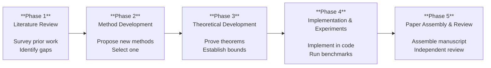
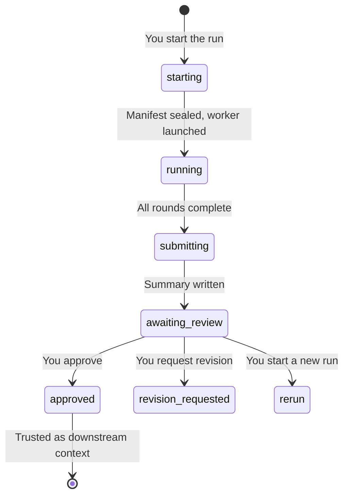

# Pipeline Overview

Research Hub organizes a research project into **five sequential phases**. Each phase produces evidence that, once you approve it, becomes trusted context for the next phase. You control every transition.

## The pipeline

## Phase summary

| Phase | Pattern | Participants | Modes | Output folder |
|-------|---------|-------------|-------|---------------|
| [1. Literature Review](./phase-1) | Parallel | theorist, research_lead, data_scientist | — | `references/` |
| [2. Method Development](./phase-2) | Parallel | theorist, research_lead, data_scientist | — | `ideas/methods/` |
| [3. Theoretical Development](./phase-3) | Debate | theorist, research_lead, data_scientist | — | `branches/<method>/evaluations/` |
| [4. Implementation & Experiments](./phase-4) | Parallel | theorist, research_lead, data_scientist | preliminary, comprehensive | `branches/<method>/draft/sections/` |
| [5. Paper Assembly & Review](./phase-5) | Sequential | paper_reviewer, research_lead | assembly, review_revision | `branches/<method>/draft/revised/` |

## How phases connect

Each phase's **approved summary** becomes frozen, hash-verified context for downstream phases. When Phase 3 runs, it receives the approved summaries of Phases 1 and 2 as trusted inputs.

This means:
- A downstream phase always knows **exactly which version** of upstream results it consumed
- **Rerunning** an upstream phase and approving the new result marks downstream phases as **stale** — you decide whether to rerun them
- The full **provenance chain** is auditable: you can trace any claim back to the exact run that produced it

## Round patterns

### Parallel (Phases 1, 2, 4)
- **Round 1**: each role works **independently** — no cross-reading
- **Round 2+**: **cross-pollination** — roles read each other's outputs, refine, and propose new ideas sparked by other perspectives

### Debate (Phase 3)
- **Round 1**: each role works independently (theorist proves, data analyst assesses cost, lead positions)
- **Round 2+**: **challenge and revise** — roles critique each other's claims, concede when persuaded, or hold with reasoning. The goal is convergence toward defensible claims.

### Sequential (Phase 5)
- Phase 5 has **two run modes**: assembly (1 round) and review-revision (2 rounds)
- **Assembly**: the lead combines all upstream artifacts into one manuscript
- **Review-revision** (gated by assembly): reviewer audits, then lead revises — runs one at a time
- Review-revision can iterate on the same assembly without re-assembling

### Run modes (Phases 4 & 5)
- Phases 4 and 5 declare **run modes** — user-selected variants with different round counts and goals
- Phase 4: preliminary (implement & test) → comprehensive (full benchmark, gated by preliminary)
- Phase 5: assembly (combine manuscript) → review-revision (audit & revise, gated by assembly)
- The gating prevents skipping ahead: you can't benchmark unvalidated code or review an unassembled paper

---

## The run lifecycle

Every phase run follows this lifecycle:

### Key rules

1. **Agents cannot approve their own result.** When agent work finishes, the run enters `awaiting_review`. Only your decision moves it forward.

2. **Only approved, current runs are trusted downstream.** An `awaiting_review` run is visible but not trusted. A stale approved run (because upstream was rerun) is marked stale until you act.

3. **One run per project at a time.** Separate projects run independently.

4. **Reruns never replace approved results.** Starting a new run preserves the prior approved run for comparison. When a run is awaiting review, you can replace it directly by checking the "replace awaiting review" checkbox in the launch form.

5. **Approving an upstream replacement marks downstream phases stale.** Their history is preserved — you decide whether to rerun them.

6. **Every run and summary persists.** Nothing is ever overwritten.

7. **Completing a phase never starts the next phase.** You alone decide when to proceed.

---

## What you do at each phase

The cycle is the same for every phase:

1. **Start the run** — choose round count, add optional direction (free-text guidance for the agents)
2. **Monitor** — watch round-by-round progress, read the live log
3. **Review** — read the HTML summary at `awaiting_review`
4. **Decide** — approve, request revision, or rerun
5. **Proceed** — start the next phase when you're satisfied

### The "direction" field

When starting any run, you can add free-text direction. Examples:
- *"Focus on graph-based sampling methods and their spectral properties"*
- *"Compare specifically against ALDI and the two-system paradigm"*
- *"The data scientist should test at N=100 and N=1000"*

This steers the agents without changing the research brief. It's the primary way to guide a run toward what you care about.

### Prerequisites are warnings, not locks

Each phase declares recommended prerequisites. If an approved prerequisite is missing, the UI explains the gap and requires an **explicit override** to proceed. This lets you move forward when you judge it safe, while ensuring the gap is acknowledged.

### Method-bound phases require an approved branch

Phases 3–5 are **method-bound**: their output goes to `branches/<method>/`. The launch button is disabled until you approve a method in Phase 2 (New Method). The approved method branch locks in which method the downstream phases operate on. Change it by approving a different method in Phase 2.

---

## Reruns: audit, fix, extend

Any phase can be rerun at any time. Research Hub treats reruns as **iterative refinement**, not clean restarts:

1. **Audit first** — read every prior round output, identify what's correct, incomplete, wrong, or missing
2. **Fix in place** — correct errors and fill gaps in the existing material
3. **Add new material** — extend with new theorems, experiments, or analysis
4. **Never replace** — prior run files are sealed history; new rounds go into a new run directory

Each phase has phase-specific rerun logic — see the individual phase pages for details.
