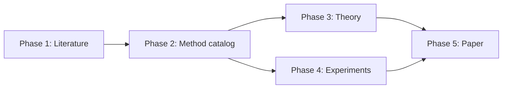

# Research workflow

Research Hub separates a research project into five phases so that you can
evaluate the evidence before deciding what happens next. A valid run updates the
phase's current scientific record according to its storage rule and preserves a
sealed provenance record. You decide whether to use the current material,
rerun with new direction, start an eligible phase, or stop.

## The five scientific questions

| Phase | Question you are deciding | Evidence you receive |
|---|---|---|
| [1. Literature Review](./phase-1) | Is the relevant literature understood well enough to define the contribution and proceed? | Search scope, closest prior work, foundations, implementations, unresolved overlap, and coverage gaps |
| [2. Method Development](./phase-2) | Is there a scientifically valuable and sufficiently precise method worth evaluating? | A ranked method menu, mathematical definitions, assumptions, novelty arguments, computational implications, and a team recommendation |
| [3. Theoretical Development](./phase-3) | Which claims are supported, which remain conjectural, and which fail under stated assumptions? | Proofs or proof plans, assumption checks, counterexamples, failure regimes, and a claim-by-claim assessment |
| [4. Implementation and Experiments](./phase-4) | Does the method work computationally and empirically under an adequate evaluation design? | Implementation evidence, diagnostics, benchmark comparisons, uncertainty, robustness checks, and limitations |
| [5. Paper Assembly and Review](./phase-5) | Is the manuscript accurate, coherent, reproducible, and ready for its intended audience? | An assembled manuscript, context-separated internal review, revised claims, and a readiness assessment |

Phase 3 and Phase 4 are sibling studies. After Phase 2, you may start either
one for any active method, then return to the other when useful. Phase 5 requires
usable current Phase 1 through Phase 4 records and exact Phase 3 and Phase 4
alignment. The interface reports exact-method applicability, sibling-basis
alignment, Phase 4 research attention, and scientific outcome separately.
Green means a displayed alignment condition is current. Yellow means inspect a
changed basis or evidence requiring attention. Red means integrity cannot be
verified. These states never start work automatically.

## Your decision cycle

Use the same scientific cycle for every phase:

1. **Frame the run.** State the question you want the team to resolve.
2. **Launch deliberately.** Choose the phase, method when applicable, available
   run settings, and any specific direction.
3. **Follow the work.** Monitor progress and inspect the reports produced during
   the run.
4. **Review the evidence.** Read the final summary, disagreements, missing work,
   and supporting artifacts needed to assess consequential claims.
5. **Choose the next action.** Use relevant material as context, rerun with
   specific direction, start another eligible phase, or stop.
6. **Launch explicitly.** No later phase or rerun starts until you choose it.

See [Review results and choose what happens next](./decisions) for a practical
review and rerun guide.

## While a run is active

Only one run can be active in a project. Open the active phase to see its
technical status and select **Open live log** when you need the detailed
execution record. A running status reports process progress, not scientific
validity.

Select **Cancel run** when you decide the work should stop. Research Hub
preserves completed work in that run's record.

If the interface reports that cleanup is pending, the project remains locked
until Research Hub can confirm that the local worker and Hermes tasks have
stopped. Select **Retry cleanup** first. Use **Release after manual
verification** only after you have independently confirmed that no worker or
Hermes task for the run remains active. Releasing the lock does not stop those
processes.

After a run stops, inspect the preserved record before deciding whether to
rerun the phase with new direction.

## What you decide before launch

Before each run, decide:

- **The scientific question.** What uncertainty should this run reduce?
- **The scope.** Is this an initial assessment, a focused correction, or an
  extension of earlier work?
- **The available run settings.** Choose a round count only when the phase offers
  it. In Phase 2, choose the full catalog or one active method. In Phase 3,
  decide whether current records are sufficient or archived Phase 3 summaries
  should also be included. In Phase 4, choose preliminary or comprehensive;
  neither scope requires the other.
- **Your direction to the team.** State the population, estimand, assumptions,
  method family, benchmark, biological setting, or claim that deserves special
  attention.
- **Whether the available inputs are adequate.** If earlier material is
  incomplete or no longer aligned with the question, decide whether to rerun
  the relevant phase, narrow the new instructions, or proceed when the launch
  conditions permit. Research Hub assembles verified current records and applies
  the Phase 2 scope or Phase 3 context choice shown in the launch form.

Good direction is specific enough to guide inquiry without deciding the answer
in advance. For example:

- "Compare the proposed estimator with methods that target the same estimand
  under dependent sampling."
- "Check whether the claimed rate requires strong convexity or only a spectral
  gap."
- "Evaluate performance across sample size, signal strength, and distribution
  shift, with uncertainty from independent repetitions."

## What the team does

The roles contribute different forms of scientific scrutiny:

- In Phases 1 and 2, the research lead, theorist, and data analyst begin with
  distinct analyses. Later rounds compare their conclusions and investigate
  specific conflicts or gaps.
- In Phase 3, the theorist performs the main mathematical analysis, the data
  analyst stress-tests its computational implications and assumptions, and the
  research lead synthesizes both reports.
- In Phase 4, the data analyst performs the main implementation and empirical
  analysis, the theorist audits correspondence with the method and theory, and
  the research lead synthesizes both reports.
- In both Phase 3 and Phase 4, later stages read earlier stages from the current
  run. Phase 3 receives current same-branch records and optional archived Phase
  3 summaries. Phase 4 receives the current theory manuscript and cumulative
  empirical package.
- In Phase 5, the research lead performs Assembly. Review & Revision uses the
  Paper Reviewer followed by the research lead.

The research lead synthesizes the reports, but does not make the user's
decision. A recommendation should state its evidence, uncertainty, and credible
alternatives.

## What every summary should let you judge

A useful phase summary should make the following visible:

- the question and scope actually examined;
- the status of each material scientific statement;
- the strongest supporting and contradicting evidence;
- assumptions, uncertainty, and conditions of validity;
- disagreements among roles and whether they were resolved;
- missing work and its consequence for later phases;
- material changes from earlier results;
- a clear recommendation with reasons;
- the earlier result used for comparison, when one exists.

A completed summary is material for scientific judgment. Completion does not
certify its claims or trigger another action. Inspect it before deciding how, or
whether, later work should use it.

## What you can do after a run

| Your action | When it is useful | Effect |
|---|---|---|
| **Let the result inform later work** | The current material is relevant and sufficiently reliable for the next question. | Verified current records are assembled according to the target phase's rules. Inspect the launch context before starting. |
| **Rerun the phase** | A new pass could resolve a gap, test a changed assumption, or use new evidence. | A new sealed run is created. A valid result updates the phase's current record according to its storage rule. |
| **Start another eligible phase** | Its required conditions are satisfied and the available evidence is sufficient for its purpose. | Only the phase you explicitly start will run. |
| **Stop or defer** | The direction is not useful or no further work is currently warranted. | Nothing else starts. The completed material remains available. |

## Dependencies and newer evidence

Phase 1 has no prerequisite. Phase 2 can use available Phase 1 literature
evidence and publishes the method catalog without selecting one method.

Phase 3 and Phase 4 both show that catalog as a read-only list. When launching
either phase, you explicitly choose an active method. The method identity,
version, and `definition_sha256` are frozen for that run, and work for the same
method is routed to one durable branch. Either sibling phase can run first. Phase 3 uses
the current theory and empirical records, with archived Phase 3 summaries only
when selected. Phase 4 uses the current theory manuscript and cumulative
empirical package.

Phase 5 requires a usable current result from each of Phases 1 through 4.
Phase 1, Phase 2, and Phase 4 may be Complete or Partial; Phase 3 must be
Complete, and Failed never qualifies. Phase 3 and Phase 4 must match the
selected method and the current sibling basis recorded by each phase. Phase 5
freezes the Phase 1 reference collection and literature synthesis as separate
inputs. Phase 4 can have no outdated or unresolved evidence.

Every Phase 2 method has one authoritative `## Mathematical definition`
section. A change that can alter a calculation advances the method version. A
status, literature, or explanatory edit that leaves this section
mathematically unchanged keeps the version. When the version advances, the
current Phase 3 package no longer matches it and Phase 4 code and scientific
outputs become outdated. Raw data and generic infrastructure remain reusable
only when their mathematical independence is recorded explicitly. Other
upstream changes can make the current manuscript basis stale. A new
reference or revised literature synthesis makes the manuscript yellow without
starting a run. The sealed earlier runs remain interpretable. Inspect the
changed input and decide whether to rerun the affected phase.

Some missing recommended prerequisites can be acknowledged through an explicit
override when the launch form offers one. Phase 3 and Phase 4 still require a
valid active method. The Phase 5 integrity and exact method-snapshot
requirements are not overridable.

## Rerun with a purpose

The intended workflow lets you return to any phase when the scientific question
warrants another pass. After Phase 2, Phase 3 and Phase 4 can be launched or
rerun independently. Phase 5 remains subject to the full Phase 1 through Phase 4
integrity and method-snapshot requirements above. A useful rerun should state
what has changed and what evidence would alter your decision.

The phases update current records differently:

1. Phase 1 adds only new unique references and rewrites the current synthesis.
2. Phase 2 updates either the full catalog or one selected active method. A
   calculation-defining change advances that method's version.
3. Phase 3 replaces the complete current theory manuscript. It uses current
   records by default and archived Phase 3 summaries only when selected.
4. Phase 4 appends new evidence, retains existing evidence identities, updates
   their dispositions, and rewrites the current empirical synthesis. A
   recomputation or revalidation creates a new evidence ID and never reactivates
   an old non-current ID.
5. Phase 5 replaces the branch's one current manuscript.

No rerun erases its sealed provenance record. The resulting current record,
however, follows the replacement or cumulative rule above.

For the location and interpretation of run summaries, scientific artifacts,
and decision records, see
[Files and research records](../reference/files-and-records).
